<!--
  GitHub profile README for github.com/abhineet-pandey
  Keep README.md and assets/meteor-header.svg together in the repository.
-->

  

   

  
  
  
  
  

## Building AI systems that survive contact with the real world

I am a **Senior Applied AI Researcher and Machine Learning Engineer** working at the intersection of **multimodal AI, computer vision, media forensics, trustworthy LLM systems, and production ML**.

My work spans the full research lifecycle—from problem formulation and model design to rigorous evaluation, scalable implementation, and deployment. I focus on AI systems that are not only accurate, but also **grounded, measurable, reproducible, observable, and useful in real operating environments**.

I am completing a **Ph.D. in Computer Science at the University at Albany, SUNY**, with research centered on robust detection and localization of manipulated scene text. My experience includes academic research, industrial R&D, government-sponsored programs, healthcare AI, startup product development, and developer tooling.

> **Research rigor. Engineering depth. Dependable AI.**

---

## Research and engineering focus

<table>
  <tr>
    <td width="50%" valign="top">
      <h3>🧠 Multimodal AI &amp; Vision</h3>
      
Scene-text understanding, synthetic media, manipulation detection and localization, diffusion models, video analysis, pose estimation, detection, segmentation, and visual reasoning.

    </td>
    <td width="50%" valign="top">
      <h3>🛡️ Trustworthy LLM Systems</h3>
      
Grounded generation, hybrid retrieval, reranking, structured outputs, agent workflows, evaluation, observability, hallucination analysis, and human-in-the-loop AI.

    </td>
  </tr>
  <tr>
    <td width="50%" valign="top">
      <h3>⚙️ Research-to-Production ML</h3>
      
Reproducible experimentation, multi-GPU training, model serving, APIs, data pipelines, vector and graph search, cloud infrastructure, CI/CD, monitoring, and edge deployment.

    </td>
    <td width="50%" valign="top">
      <h3>🚀 Applied AI Products</h3>
      
Research intelligence, grant discovery, collaborator recommendation, patent analysis, document intelligence, scientific developer tools, and evidence-grounded decision support.

    </td>
  </tr>
</table>

---

## Featured work

<table>
  <tr>
    <td width="50%" valign="top">
      <h3>🔎 <a href="https://github.com/abhineet-pandey/TextSleuth">TextSleuth</a></h3>
      
A dataset and baseline for detecting manipulated text in natural scenes, designed to advance fine-grained media-forensics research.

      
<code>Computer Vision</code> <code>Media Forensics</code> <code>Scene Text</code>

      
<strong>Published at IEEE MIPR 2024</strong>

    </td>
    <td width="50%" valign="top">
      <h3>🧭 <a href="https://abhineet.xyz">GrantsMate</a></h3>
      
A production-oriented research-intelligence platform for funding discovery, collaborator matching, institutional knowledge retrieval, and evidence-grounded recommendations.

      
<code>RAG</code> <code>Reranking</code> <code>Knowledge Graphs</code> <code>Agents</code>

      
<strong>Research-to-production AI platform</strong>

    </td>
  </tr>
  <tr>
    <td width="50%" valign="top">
      <h3>📚 <a href="https://abhineet.xyz">Filippo</a></h3>
      
An evidence-grounded patent-analysis and comparison system for navigating dense technical documents and producing traceable findings.

      
<code>Document AI</code> <code>LLMs</code> <code>Semantic Search</code>

      
<strong>Technical intelligence and decision support</strong>

    </td>
    <td width="50%" valign="top">
      <h3>🧬 DARPA Semantic Forensics</h3>
      
Multimodal research contributions to falsified-media detection using object, scene-text, and human-pose evidence.

      
<code>Multimodal AI</code> <code>Forensics</code> <code>High-Stakes AI</code>

      
<strong>Government-sponsored research</strong>

    </td>
  </tr>
</table>

  <a href="https://abhineet.xyz"><strong>Explore projects, publications, patents, and case studies →</strong></a>

---

## Research software &amp; developer tools

I publish tools that make AI research, remote computing, scientific writing, and agentic workflows more **inspectable, reproducible, secure, and usable**.

<table>
  <tr>
    <td width="50%" valign="top">
      <h3>🔬 <a href="https://open-vsx.org/extension/abhineet-pandey/agent-inspector">Agent Inspector</a></h3>
      
Observability tooling for AI coding agents. Inspect agent-visible context, files, token usage, and trust signals inside VS Code-compatible editors.

      

      
<code>Agentic AI</code> <code>Observability</code> <code>Developer Trust</code>

    </td>
    <td width="50%" valign="top">
      <h3>🛰️ <a href="https://open-vsx.org/extension/abhineet-pandey/pipe-explorer">Pipe Explorer</a></h3>
      
A unified workspace for managing remote compute and service pipes, including Slurm-hosted Jupyter sessions, tunnels, streams, and custom services.

      

      
<code>Remote Compute</code> <code>Slurm</code> <code>Research Infrastructure</code>

    </td>
  </tr>
  <tr>
    <td width="50%" valign="top">
      <h3>✍️ <a href="https://open-vsx.org/extension/abhineet-pandey/texpilot">TexPilot</a></h3>
      
A professional LaTeX research workspace with integrated compilation, diagnostics, logs, preview, and local-first AI assistance.

      

      
<code>Research Tooling</code> <code>LaTeX</code> <code>Local-First AI</code>

    </td>
    <!-- <td width="50%" valign="top">
      <h3>📝 <a href="https://open-vsx.org/extension/abhineet-pandey/texpilot-vscode">TeXPilot LaTeX Workspace</a></h3>
      
A structured scientific-writing environment for students, researchers, and technical teams using VS Code-compatible editors.

      

      
<code>Scientific Writing</code> <code>Academic Productivity</code> <code>VS Code</code>

    </td> -->
  </tr>
</table>

  <a href="https://open-vsx.org/namespace/abhineet-pandey"><strong>View all published Open VSX extensions →</strong></a>

---

## Selected research &amp; intellectual property

- **ForensiText: ROI-Guided Multimodal Forensics for Scene Text Tampering Detection and Localization** — AVSS 2026
- **Integrating Manual Preprocessing with Automated Feature Extraction for Improved Rodent Seizure Classification** — *Epilepsy & Behavior*, 2025
- **TextSleuth: A New Dataset and Baseline for Scene Text Manipulation Detection** — IEEE MIPR 2024
- Research contributions to the **DARPA Semantic Forensics (SemaFor)** program
- Patent contributions from industrial R&D in robotic perception and intelligent imaging systems

---

## Technical foundation

  

  
<strong>Research and engineering capabilities</strong>

   

  **Applied AI:** multimodal learning, diffusion models, transformers, computer vision, synthetic media, model evaluation, experiment design, and error analysis  
  **LLM systems:** RAG, agentic workflows, hybrid retrieval, cross-encoder reranking, structured generation, grounding, observability, and policy-aware workflows  
  **Data and infrastructure:** PostgreSQL, Neo4j, FAISS, Pinecone, Redis, Docker, Kubernetes, Slurm, NVIDIA GPU systems, Azure, and AWS  
  **Engineering:** Python, C, C++, CUDA, SQL, FastAPI, React, GitHub Actions, Linux, cloud services, edge AI, and production APIs

---

## GitHub insights

  <picture>
    <source media="(prefers-color-scheme: dark)" srcset="https://github-readme-stats.vercel.app/api?username=abhineet-pandey&show_icons=true&hide_border=true&theme=github_dark&rank_icon=github&include_all_commits=true" />
    <source media="(prefers-color-scheme: light)" srcset="https://github-readme-stats.vercel.app/api?username=abhineet-pandey&show_icons=true&hide_border=true&theme=default&rank_icon=github&include_all_commits=true" />
    
  </picture>

  <picture>
    <source media="(prefers-color-scheme: dark)" srcset="https://github-readme-stats.vercel.app/api/top-langs/?username=abhineet-pandey&layout=compact&hide_border=true&theme=github_dark&langs_count=8" />
    <source media="(prefers-color-scheme: light)" srcset="https://github-readme-stats.vercel.app/api/top-langs/?username=abhineet-pandey&layout=compact&hide_border=true&theme=default&langs_count=8" />
    
  </picture>

   

  <picture>
    <source media="(prefers-color-scheme: dark)" srcset="https://github-readme-activity-graph.vercel.app/graph?username=abhineet-pandey&theme=github-dark&hide_border=true&area=true" />
    <source media="(prefers-color-scheme: light)" srcset="https://github-readme-activity-graph.vercel.app/graph?username=abhineet-pandey&theme=github-light&hide_border=true&area=true" />
    
  </picture>

---

## Let’s build dependable AI

I am interested in senior applied research and engineering opportunities involving **multimodal AI, computer vision, synthetic-media forensics, trustworthy LLM applications, agentic systems, AI evaluation, and production ML platforms**.

I am especially drawn to teams where researchers are expected to move beyond prototypes: define the problem, establish rigorous evaluation, make sound architectural decisions, and help deliver reliable systems.

  <a href="mailto:apandey@albany.edu"><strong>Email</strong></a>
  &nbsp;·&nbsp;
  <a href="https://www.linkedin.com/in/pabhineet/"><strong>LinkedIn</strong></a>
  &nbsp;·&nbsp;
  <a href="https://abhineet.xyz"><strong>Portfolio</strong></a>
  &nbsp;·&nbsp;
  <a href="https://open-vsx.org/namespace/abhineet-pandey"><strong>Open VSX</strong></a>

    

  <strong>Research rigor · Engineering depth · Production discipline</strong>

   
  From research questions to reliable AI systems.

